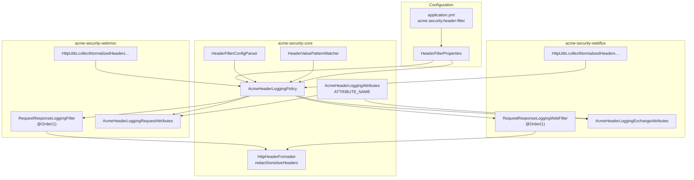

# Request / response header logging filter — design

This document describes how **acme-security** decides when to emit **DEBUG-level dumps of HTTP request and response headers**, how that differs from other application logging, and how to **reuse the approach** in other Spring projects (MVC and/or WebFlux).

---

## 1. Scope: what this feature does and does not do

### In scope

- Optional **human-readable DEBUG logs** of incoming request headers and outgoing response headers (cURL-style formatting via `HttpHeaderFormatter`).
- **Redaction** of obviously sensitive header *values* (authorization, cookies, tokens, etc.) before anything is logged.
- **Suppressing those DEBUG dumps** for identifiable “probe” or infrastructure traffic (typically by matching **`User-Agent`** or other headers against configurable patterns).
- A **request-scoped marker** (servlet request attribute / WebFlux exchange attribute) so other components can see “this request matched ignore rules” without re-parsing headers.

### Out of scope (by design)

- **Silencing all loggers** for a request (e.g. `AuthenticationService`, controllers, Actuator). Only the **header-dump filter** is gated by this policy.
- **Authentication or authorization**. Header patterns are for **logging noise**, not for security decisions (clients can spoof `User-Agent`).
- **Path-based suppression** of header dumps. Earlier iterations could skip logging by URL; the current design uses **header-driven rules only**, so the same path can be logged for a “real” client and skipped for a probe if their headers differ.

---

## 2. Goals and constraints

| Goal | How it is met |
| ---- | ------------- |
| Shared policy between MVC and WebFlux | `AcmeHeaderLoggingPolicy` in **acme-security-core**; stack-specific code only collects headers and invokes the policy. |
| Configurable without code changes | `HeaderFilterProperties` bound from `acme.security.header-filter` in YAML. |
| Safe under async servlet and reactive execution | State is stored on **`HttpServletRequest` / `ServerWebExchange`**, not `ThreadLocal`. |
| Testable rules | Policy and pattern matching are plain Java; `AcmeHeaderLoggingPolicyTest` locks in behavior. |

---

## 3. High-level architecture



**Responsibility split**

- **Core**: parse config, compile matchers, answer `shouldLog` / `matchesIgnoreRules`, normalize header maps, format/redact for output.
- **WebMVC**: `OncePerRequestFilter`, `ContentCachingResponseWrapper` to observe response headers, `HttpServletRequest` attributes.
- **WebFlux**: `WebFilter`, `ServerHttpResponseDecorator`, `ServerWebExchange` attributes (plus a guard attribute to avoid duplicate logging if the filter runs more than once in an edge case).

---

## 4. Configuration

Prefix: **`acme.security.header-filter`** (`HeaderFilterProperties`).

| Property | Type | Role |
| -------- | ---- | ---- |
| `disabled` | boolean | If `true`, **no** header dumps run regardless of DEBUG level or headers. |
| `ignore-headers` | JSON string | Map from **lowercase** header name → set of patterns. If **any** configured header has **any** value matching **any** of its patterns, the request is treated as “ignored” for header dumping (see §5). |

Example (also in `acme-security-core/src/test/resources/sample-application.yml`):

```yaml
acme:
  security:
    header-filter:
      disabled: false
      ignore-headers: '{"user-agent":["ELB-HealthChecker/*","HealthChecker/*","kube-probe/*"]}'
```

Subject/issuer header **names** for mTLS-style auth are separate: **`acme.security.headers`** (`HeadersProperties`). They affect security filters and OpenAPI, not the ignore-rule keys unless you add them to `ignore-headers`.

---

## 5. Policy semantics (`AcmeHeaderLoggingPolicy`)

### 5.1 Startup

1. `ignore-headers` JSON is parsed (Jackson; trailing commas allowed).
2. Header names in the map are normalized to **lowercase** (e.g. `User-Agent` → `user-agent`).
3. Each pattern becomes a `HeaderValuePatternMatcher`:
   - No `*`: **exact** string match.
   - Contains `*`: segments between stars are `Pattern.quote`’d and joined with `.*` (simple glob semantics).

### 5.2 Per-request header map

Filters build `Map<String, List<String>>` with **lowercase keys** (see `HttpUtils.collectNormalizedHeadersForLoggingPolicy` in each stack module). This must stay consistent with the policy.

### 5.3 `matchesIgnoreRules(headers)`

- If there are no compiled rules, returns `false`.
- Otherwise: for **each** entry `(headerName, matchers)` in the config, if the request has that header and **any** value matches **any** matcher, the **overall** result can become true.
- Across **different** header names in the config, the implementation uses **OR**: matching **any** configured header is enough to count as “ignored.”  
  (Typical configs only set `user-agent`, so behavior is “probe UA → ignore.”)

### 5.4 `shouldLog(debugEnabled, headers)`

Returns **true** only if **all** hold:

1. `disabled` is `false`
2. `debugEnabled` is `true` (the filter logger is at DEBUG)
3. `matchesIgnoreRules(headers)` is **false**

So: **ignore rules suppress dumps when DEBUG is on**; they do not “turn on” logging.

---

## 6. Filter behavior (per request)

### 6.1 Spring MVC — `RequestResponseLoggingFilter`

- **`@Order(1)`** — runs before `DnValidationFilter` (`@Order(2)`), so header dumps (when enabled) see the raw request as early as possible.
- Steps:
  1. Normalize headers.
  2. If `matchesIgnoreRules` → `AcmeHeaderLoggingRequestAttributes.put(request, true)` (sets request attribute `acme.security.header-filter.suppressed` = `Boolean.TRUE`).
  3. If `!shouldLog(...)` → `filterChain.doFilter` and **return** (no wrapper, no DEBUG lines).
  4. Else → redact, `log.debug` request, wrap response with `ContentCachingResponseWrapper`, proceed, in `finally` log response headers and `copyBodyToResponse()`.

### 6.2 WebFlux — `RequestResponseLoggingWebFilter`

- **`@Order(1)`** — same ordering idea relative to other security filters in this project.
- Steps mirror MVC, using `ServerWebExchange` and `ServerHttpResponseDecorator`.
- **`ALREADY_LOGGED_KEY`**: if the filter were invoked again on the same exchange, skip re-logging (defensive).

### 6.3 Request-scoped marker vs `ThreadLocal`

The attribute **`AcmeHeaderLoggingAttributes.ATTRIBUTE_NAME`** (`acme.security.header-filter.suppressed`) is stored on:

- **MVC**: `HttpServletRequest.setAttribute`
- **WebFlux**: `exchange.getAttributes().put`

**Why not `ThreadLocal`?** Servlet async and WebFlux can run different stages on different threads. Request/exchange attributes are tied to the **logical request**, which matches how frameworks propagate request context.

**Note:** The **logging decision** for the filter is driven by **`shouldLog` / `matchesIgnoreRules`**, not by reading the attribute back. The attribute is for **other** code that wants a stable flag. If you need “manual suppress without matching ignore-headers,” extend `shouldLog` (or the filter) to also check `isSuppressed` — that is not the default today.

---

## 7. Redaction (`HttpHeaderFormatter.redactSensitiveHeaders`)

Before `log.debug`, headers are copied into a structure that replaces values for names considered sensitive (fixed set + names containing `token` / `secret` / ending in `api-key`). This is **defense in depth**; it does not replace proper secret management.

---

## 8. Observability at startup

`AbstractAcmeSecurityStartupListener` (with MVC/WebFlux subclasses) logs a **DEBUG** snapshot of bound header names and the effective ignore-header patterns at `ApplicationReadyEvent`. Useful to confirm the running app picked up the intended YAML.

---

## 9. Porting checklist for other projects

1. **Policy + properties**  
   - Copy or adapt `HeaderFilterProperties`, `AcmeHeaderLoggingPolicy`, `HeaderFilterConfigParser`, `HeaderValuePatternMatcher`, and tests.  
   - Register `@EnableConfigurationProperties` (or use `@ConfigurationPropertiesScan`).

2. **Formatting**  
   - Reuse or simplify `HttpHeaderFormatter` (request line + header multiline dump + redaction).

3. **Servlet filter**  
   - `OncePerRequestFilter`, collect headers with **lowercase keys**, call `shouldLog`, optionally set a request attribute, use `ContentCachingResponseWrapper` if you need response headers.

4. **WebFlux**  
   - `WebFilter`, same header map contract, `ServerHttpResponseDecorator`, consider a duplicate-invocation guard.

5. **Ordering**  
   - Choose `@Order` so logging runs where you need it relative to security and Actuator (this project uses **1** for logging, **2** for DN validation).

6. **Logging configuration**  
   - Set the filter’s logger to DEBUG only in environments where dumps are wanted; `shouldLog` already requires DEBUG.

7. **Documentation for operators**  
   - Document that **`ignore-headers` is not a security boundary** and that probes should use recognizable User-Agents in your environment (or add custom headers at the edge if you control them).

---

## 10. Reference: main types

| Piece | Module | Role |
| ----- | ------ | ---- |
| `HeaderFilterProperties` | core | Binds `acme.security.header-filter.*` |
| `AcmeHeaderLoggingPolicy` | core | `shouldLog`, `matchesIgnoreRules`, `normalizeHeaderMap` |
| `AcmeHeaderLoggingAttributes` | core | Attribute key + helpers for `Map<String,Object>` |
| `AcmeHeaderLoggingRequestAttributes` | webmvc | `put` / `clear` / `isSuppressed` on `HttpServletRequest` |
| `AcmeHeaderLoggingExchangeAttributes` | webflux | Same for `ServerWebExchange` |
| `RequestResponseLoggingFilter` | webmvc | Servlet filter |
| `RequestResponseLoggingWebFilter` | webflux | Reactive filter |
| `AcmeHeaderLoggingPolicyTest` | core (test) | Regression tests for probe vs normal clients |

---

## 11. Related repo assets

- Simulator probe User-Agents: `scripts/simulator/simulate-traffic.sh` (pairs with default `ignore-headers` examples).
- Manual “real client” request: `scripts/simulator/simulate-request.sh` / `make sim-request-*`.
- Human-oriented property summary: `acme-security/README.md`.

---

## 12. Summary

**Filtering** here means: *conditionally skip DEBUG header dumps* based on a **central policy** fed by **JSON header patterns**, with **stack-specific filters** that only adapt HTTP APIs (servlet vs reactive). **Request-scoped attributes** record when ignore rules matched, using a mechanism that remains valid across **async** and **reactive** threading models—without relying on `ThreadLocal` for request identity.
